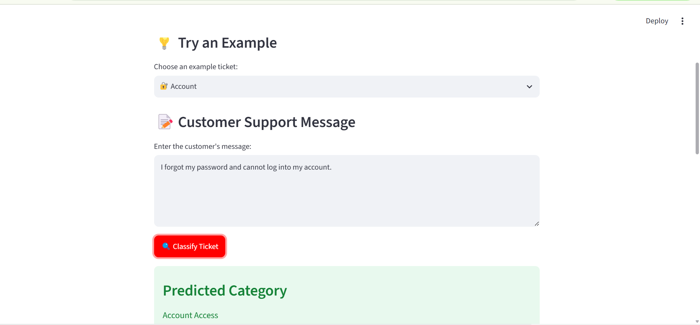
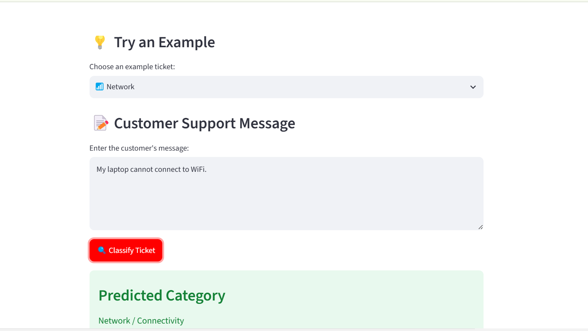
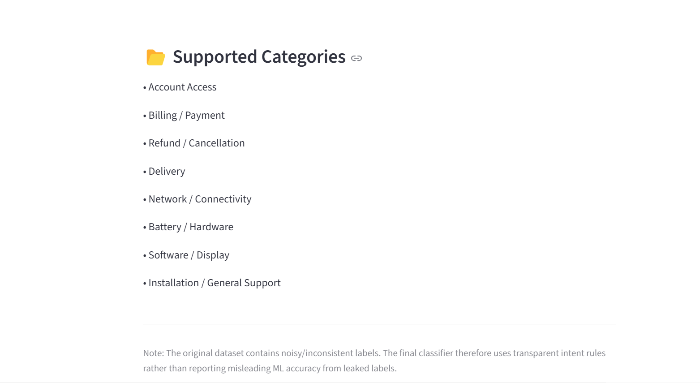

# Customer Support Ticket Classifier

An AI/ML project that classifies customer support messages into meaningful support-intent categories.

## 📌 Project Overview

Customer support teams receive a large number of support tickets every day. Manually identifying the type of issue can be time-consuming.

This project demonstrates a lightweight customer-support intent classification system that takes a customer's message as input and assigns it to one of eight support categories.

The application is built with Python and Streamlit and provides an interactive web interface for testing customer support messages.

## 🎯 Objective

The main objectives of this project are:

- Classify customer support messages into relevant intent categories.
- Explore and understand a real-world customer support dataset.
- Identify problems with noisy or inconsistent dataset labels.
- Build a transparent and explainable classification approach.
- Provide an interactive Streamlit application.
- Create a project that can be extended into a production-level support automation system.

## 📊 Dataset

The project uses the Customer Support Tickets dataset.

The dataset contains 8,469 customer support tickets and includes information such as:

- Ticket ID
- Customer information
- Product purchased
- Ticket type
- Ticket subject
- Ticket description
- Ticket status
- Ticket priority
- Ticket channel
- Resolution information
- Customer satisfaction rating

The primary text fields investigated were:

- Ticket Subject
- Ticket Description

> Note: The dataset is intentionally not included in this GitHub repository because it is excluded through `.gitignore`.

## 🔎 Data Exploration

During exploratory analysis, the dataset contained five `Ticket Type` categories:

- Billing inquiry
- Cancellation request
- Product inquiry
- Refund request
- Technical issue

However, analysis showed that the `Ticket Type` labels were not strongly aligned with the actual ticket subjects or descriptions.

The same ticket subjects appeared across multiple different ticket types, making the original target difficult to predict from text.

A five-class random baseline is approximately 20%.

Conventional text-classification experiments achieved approximately 21% accuracy, indicating that the original `Ticket Type` target was not sufficiently predictable from the available text.

## ⚠️ Data Quality and Label Leakage

An early experiment produced approximately 99.7% accuracy when predicting `Ticket Subject`.

However, further investigation showed that the input text used for training contained the `Ticket Subject` itself.

This is a form of target leakage because the model was given information that directly revealed the target.

Therefore, the 99.7% result was rejected and is **not used as the final model performance**.

This project intentionally avoids reporting misleading accuracy caused by target leakage.

## 🧠 Final Classification Approach

Because the original labels were noisy and inconsistent, the final application uses a transparent rule-based intent classification approach.

The classifier examines the customer's message for relevant keywords and phrases and assigns an appropriate support category.

This approach has several advantages:

- Simple
- Fast
- Explainable
- Easy to debug
- Easy to modify
- Suitable for a prototype
- Does not depend on unreliable dataset labels

The project also includes earlier machine-learning experiments using text features to investigate whether the original dataset labels were predictable.

## 📸 Application Screenshots

### Account Access Classification



### Network / Connectivity Classification



### Supported Categories



## 🏷️ Supported Categories

The application supports eight categories:

1. Account Access
2. Billing / Payment
3. Refund / Cancellation
4. Delivery
5. Network / Connectivity
6. Battery / Hardware
7. Software / Display
8. Installation / General Support

## 🏗️ Project Structure

```text
support-ticket-classifier/
│
├── app.py
│
├── src/
│   └── intent_classifier.py
│
├── images/
│   ├── screenshot-account.png
│   ├── screenshot-categories.png
│   └── screenshot-network.png
│
├── data/
│   └── customer_support_tickets.csv
│
├── models/
│
├── venv/
│
├── README.md
├── requirements.txt
└── .gitignore